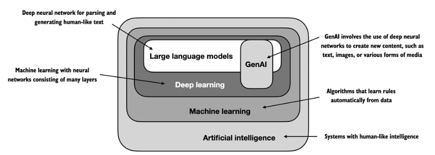

# **Understanding Large Language Models**

-   Large language models (LLMs) are **deep neural network models**.
-   Before the advent of large language models, **traditional methods excelled at categorization tasks such as email spam classification and straightforward pattern recognition that could be captured with handcrafted rules or simpler models**. 
- Traditional methods **typically underperformed in language tasks that demanded complex understanding and generation abilities, such as parsing detailed instructions, conducting contextual analysis, or creating coherent and contextually appropriate original text**.
-   **LLMs have remarkable capabilities to understand, generate, and interpret human language**. However, it's important to clarify that **when we say language models "understand," we mean that they can process and generate text in ways that appear coherent and contextually relevant, not that they possess human-like consciousness or comprehension**.
- **Enabled by advancements in deep learning, which is a subset of machine learning and artificial intelligence (AI) focused on neural networks, LLMs are trained on vast quantities of text data**. This allows LLMs to capture deeper contextual information and subtleties of human language compared to previous approaches. As a result, **LLMs have significantly improved performance in a wide range of NLP tasks, including text translation, sentiment analysis, question answering, and many more.**
- Another **important distinction between contemporary LLMs and earlier NLP models is that these earlier NLP models were typically designed for specific tasks, for example, text categorization, language translation and so forth**. Whereas those earlier NLP models excelled in their narrow applications, **LLMs demonstrate a broader proficiency across a wide range of NLP tasks.**
- **The success behind LLMs can be attributed to the transformer architecture which underpins many LLMs, and the vast amounts of data LLMs are trained on**, allowing them to capture a wide variety of linguistic nuances, contexts, and patterns that would be challenging to manually encode.

## What is an LLM?

 - **An LLM, a large language model, is a neural network designed to understand, generate, and respond to human-like text.** 
 - **These models are deep neural networks trained on massive amounts of text data, sometimes encompassing large portions of the entire publicly available text on the internet.**
 - **The "large" in large language model refers to both the model's size in terms of parameters and the immense dataset on which it's trained.** **Models like this often have tens or even hundreds of billions of parameters, which are the adjustable weights in the network that are optimized during training to predict the next word in a sequence.** Next-word prediction is sensible because it harnesses the inherent sequential nature of language to train models on understanding context, structure, and relationships within text. Yet, it is a very simple task and so it is surprising to many researchers that it can produce such capable models. 
 - **LLMs utilize an architecture called the  _transformer_ , which allows them to pay selective attention to different parts of the input when making predictions**, making them especially adept at handling the nuances and complexities of human language.
 - **Since LLMs are capable of _generating_ text, LLMs are also often referred to as a form of generative artificial intelligence (AI), often abbreviated as _generative AI_ or _GenAI_**. **AI encompasses the broader field of creating machines that can perform tasks requiring human-like intelligence, including understanding language, recognizing patterns, and making decisions, and includes subfields like machine learning and deep learning.**
 

 ##### Figure shows this hierarchical depiction of the relationship between the different fields suggests, LLMs represent a specific application of deep learning techniques, leveraging their ability to process and generate human-like text. Deep learning is a specialized branch of machine learning that focuses on using multi-layer neural networks. And machine learning and deep learning are fields aimed at implementing algorithms that enable computers to learn from data and perform tasks that typically require human intelligence.

 - **The algorithms used to implement AI are the focus of the field of machine learning. Specifically, machine learning involves the development of algorithms that can learn from and make predictions or decisions based on data without being explicitly programmed.** To illustrate this, imagine a spam filter as a practical application of machine learning. Instead of manually writing rules to identify spam emails, a machine learning algorithm is fed examples of emails labeled as spam and legitimate emails. By minimizing the error in its predictions on a training dataset, the model then learns to recognize patterns and characteristics indicative of spam, enabling it to classify new emails as either spam or legitimate.
 - As illustrated in Figure , deep learning is a subset of machine learning that focuses on utilizing neural networks with three or more layers (also called deep neural networks) to model complex patterns and abstractions in data. In contrast to deep learning, traditional machine learning requires manual feature extraction. This means that human experts need to identify and select the most relevant features for the model.
 - While the field of AI is nowadays dominated by machine learning and deep learning, it also includes other approaches, **for example, using rule-based systems, genetic algorithms, expert systems, fuzzy logic, or symbolic reasoning**.
 - Returning to the spam classification example, in traditional machine learning, human experts might manually extract features from email text such as the frequency of certain trigger words ("prize," "win," "free"), the number of exclamation marks, use of all uppercase words, or the presence of suspicious links. This dataset, created based on these expert-defined features, would then be used to train the model. In contrast to traditional machine learning, deep learning does not require manual feature extraction. This means that human experts do not need to identify and select the most relevant features for a deep learning model. (However, in both traditional machine learning and deep learning for spam classification, you still require the collection of labels, such as spam or non-spam, which need to be gathered either by an expert or users.)

 ## Applications of LLMs
- Owing to their advanced capabilities to parse and understand unstructured text data, LLMs have a broad range of applications across various domains. 
- LLMs are employed for **machine translation, generation of novel texts**, **sentiment analysis, text summarization, and many other tasks**. LLMs have recently been **used for content creation, such as writing fiction, articles, and even computer code**.
- **LLMs can also power sophisticated chatbots and virtual assistants, such as OpenAI's ChatGPT or Google's Gemini (formerly called Bard)**, which can answer user queries and augment traditional search engines such as Google Search or Microsoft Bing.
- **LLMs may be used for effective knowledge retrieval from vast volumes of text in specialized areas such as medicine or law**. This includes sifting through documents, summarizing lengthy passages, and answering technical questions.
- **LLMs are invaluable for automating almost any task that involves parsing and generating text**. Their applications are virtually endless, and as we continue to innovate and explore new ways to use these models, **it's clear that LLMs have the potential to redefine our relationship with technology, making it more conversational, intuitive, and accessible**

## Stages of building and using LLMs
- The **general process of creating an LLM includes pretraining and finetuning**. **The term "pre" in "pretraining" refers to the initial phase where a model like an LLM is trained on a large, diverse dataset to develop a broad understanding of language**. This pretrained model then serves as a foundational resource that can be further refined through **finetuning, a process where the model is specifically trained on a narrower dataset that is more specific to particular tasks or domains**. This two-stage training approach consisting of pretraining and finetuning is depicted in figure below.

